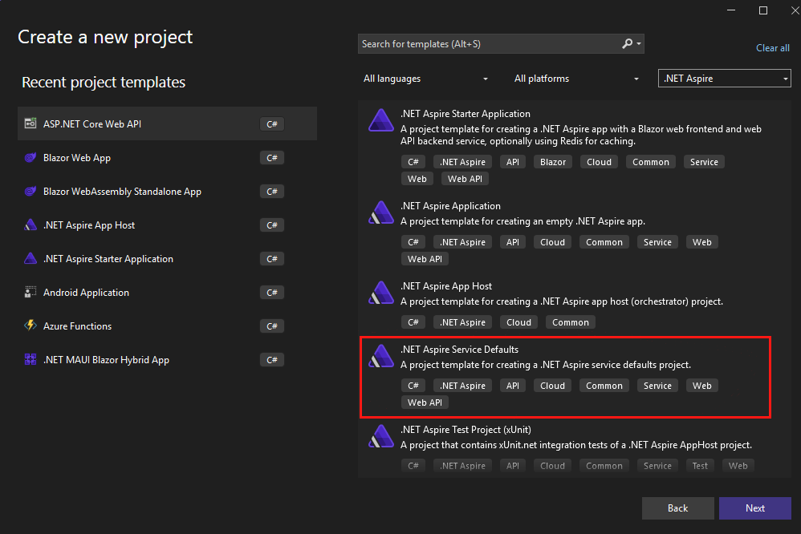

# Valores predeterminados del servicio, también conocidos como valores predeterminados inteligentes

## Introducción

.NET Aspire proporciona un conjunto de valores predeterminados inteligentes para los servicios que se utilizan comúnmente en las aplicaciones .NET. Estos valores predeterminados están diseñados para ayudarte a comenzar rápidamente y proporcionar una experiencia consistente en diferentes tipos de aplicaciones. Esto incluye:

- Telemetría: Métricas, trazas, registro
- Resiliencia
- Comprobaciones de estado
- Descubrimiento de servicios

## Crear proyecto de valores predeterminados del servicio

### Visual Studio y Visual Studio Code

1. Agrega un nuevo proyecto a la solución llamado `ServiceDefaults`:

	- Haz clic derecho en la solución y selecciona `Agregar` > `Nuevo proyecto`.
	- Selecciona la plantilla de proyecto `.NET Aspire Service Defaults`.
	- Nombra el proyecto `ServiceDefaults`.
	- Haz clic en `Siguiente` > `Crear`.

	*Visual Studio*
	

	*Visual Studio Code*
	


### Línea de comandos

1. Crea un nuevo proyecto utilizando el comando `dotnet new aspire-servicedefaults`:

	```bash
	dotnet new aspire-servicedefaults -n ServiceDefaults
	```

## Configurar los valores predeterminados del servicio

1. Agrega una referencia al proyecto `ServiceDefaults` en los proyectos `Api` y `MyWeatherHub`:

	- Haz clic derecho en el proyecto `Api` y selecciona `Agregar` > `Referencia`.
		- Marca el proyecto `ServiceDefaults` y haz clic en `Aceptar`.
	- Haz clic derecho en el proyecto `Api` y selecciona `Agregar` > `Referencia`.
		- Marca el proyecto `MyWeatherHub` y haz clic en `Aceptar`.

	> Consejo: En Visual Studio 2022, puedes arrastrar y soltar el proyecto sobre otro proyecto para agregar una referencia.

1. En los proyectos `Api` y `MyWeatherHub`, actualiza los archivos `Program.cs`, agregando la siguiente línea inmediatamente después de la línea `var builder = WebApplication.CreateBuilder(args);`:

	```csharp
	builder.AddServiceDefaults();
	```

1. En los proyectos `Api` y `MyWeatherHub`, actualiza los archivos `Program.cs`, agregando la siguiente línea inmediatamente después de la línea `var app = builder.Build();`:

	```csharp
	app.MapDefaultEndpoints();
	```

## Ejecutar la aplicación

1. Ejecuta la aplicación utilizando una configuración de multiproyecto en Visual Studio o Visual Studio Code.

	- Visual Studio: Haz clic derecho en la solución `MyWeatherHub` y ve a propiedades. Selecciona `Api` y `MyWeatherHub` como proyectos de inicio, selecciona `Aceptar`. 
		- 
		- Haz clic en `Iniciar` para iniciar y depurar ambos proyectos.
	- Visual Studio Code: Ejecuta los proyectos `Api` y `MyWeatherHub` utilizando el panel `Ejecutar y depurar`. Hemos proporcionado un archivo `launch.json` con las configuraciones necesarias para ejecutar ambos.

1. Prueba la aplicación navegando a las siguientes URL:

	- [https://localhost:7032/swagger/index.html](https://localhost:7032/swagger/index.html) - API
	- [https://localhost:7274/](https://localhost:7274/) - MyWeatherHub

1. Deberías ver la interfaz de usuario de Swagger para la API y la página de inicio de MyWeatherHub.
1. También puedes ver las comprobaciones de estado de la API navegando a [https://localhost:7032/health](https://localhost:7032/health).
1. También puedes ver las comprobaciones de estado de MyWeatherHub navegando a [https://localhost:7274/health](https://localhost:7274/health).
1. Visualiza los registros en la terminal para ver las comprobaciones de estado y otros datos de telemetría, como la resiliencia con Polly:

	```bash
	Polly: Información: Intento de ejecución. Origen: '-standard//Standard-Retry', Clave de operación: '', Resultado: '200', Manejado: 'False', Intento: '0', Tiempo de ejecución: '13.0649'
	```

1. Haz clic en 5 ciudades diferentes y se lanzará un error "aleatorio". Verás la política de re-intento en acción.

	```bash
	Polly: Advertencia: Intento de ejecución. Origen: '-standard//Standard-Retry', Clave de operación: '', Resultado: '500', Manejado: 'True', Intento: '0', Tiempo de ejecución: '9732.8258'
	Polly: Advertencia: Se produjo un evento de resiliencia. Nombre del evento: 'OnRetry', Origen: '-standard//Standard-Retry', Clave de operación: '', Resultado: '500'
	System.Net.Http.HttpClient.NwsManager.ClientHandler: Información: Enviando solicitud HTTP GET http://localhost:5271/forecast/AKZ318
	```
