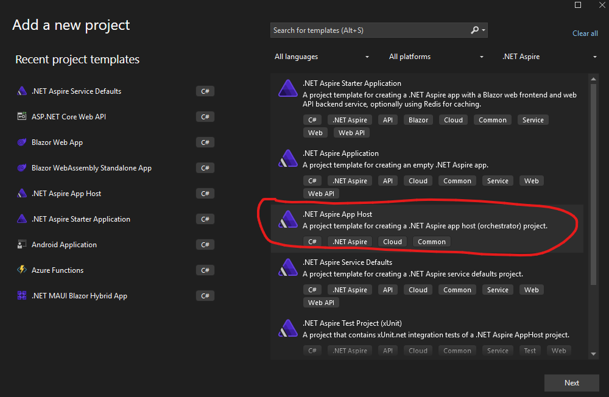
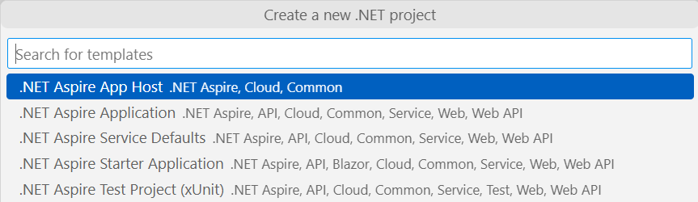
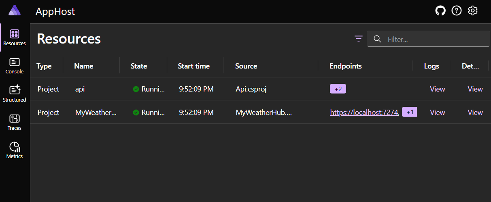
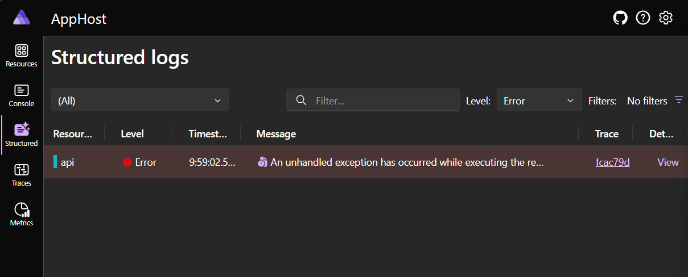

# Panel de control y orquestación con .NET Aspire App Host

.NET Aspire proporciona APIs para expresar recursos y dependencias dentro de tu aplicación distribuida. Además de estas APIs, hay herramientas que permiten algunos escenarios interesantes. El orquestador está destinado a fines de desarrollo local.

Antes de continuar, considera algunos términos comunes utilizados en .NET Aspire:

* *Modelo de aplicación*: Una colección de recursos que conforman tu aplicación distribuida (DistributedApplication).
* *Proyecto de anfitrión de aplicación/orquestador*: El proyecto .NET que orquesta el modelo de aplicación, nombrado con el sufijo *.AppHost (por convención).
* *Recurso*: Un recurso representa una parte de una aplicación, ya sea un proyecto .NET, un contenedor, un ejecutable u otro recurso como una base de datos, una caché o un servicio en la nube (como un servicio de almacenamiento).
* *Referencia*: Una referencia define una conexión entre recursos, expresada como una dependencia mediante la API `WithReference`.

## Crear proyecto de anfitrión de aplicación

### Visual Studio y Visual Studio Code

1. Agrega un nuevo proyecto a la solución llamado `AppHost`:

	- Haz clic derecho en la solución y selecciona `Agregar` > `Nuevo proyecto`.
	- Selecciona la plantilla de proyecto `.NET Aspire App Host`.
	- Nombra el proyecto `AppHost`.
	- Haz clic en `Siguiente` > `Crear`.

	*Visual Studio*
	

	*Visual Studio Code*
	


### Línea de comandos

1. Crea un nuevo proyecto utilizando el comando `dotnet new aspire-apphost`:

	```bash
	dotnet new aspire-apphost -n AppHost
	```

## Configurar valores predeterminados del servicio

1. Agrega una referencia a los proyectos `Api` y `MyWeatherHub` en el nuevo proyecto `AppHost`:

	- Haz clic derecho en el proyecto `AppHost` y selecciona `Agregar` > `Referencia`.
		- Marca los proyectos `Api` y `MyWeatherHub` y haz clic en `Aceptar`.

	> Consejo: En Visual Studio 2022, puedes arrastrar y soltar el proyecto sobre otro proyecto para agregar una referencia.

1. Cuando se agregan estas referencias, los generadores de código fuente generan automáticamente el código necesario para referenciar los proyectos en el anfitrión de la aplicación.

## Orquestar la aplicación

1. En el proyecto `AppHost`, actualiza el archivo `Program.cs`, agregando la siguiente línea inmediatamente después de la línea `var builder = DistributedApplication.CreateBuilder(args);`:

	```csharp
	var api = builder.AddProject<Projects.Api>("api");

	var web = builder.AddProject<Projects.MyWeatherHub>("myweatherhub");
	```

## Ejecutar la aplicación

1. Establece el proyecto `AppHost` como proyecto de inicio en Visual Studio haciendo clic derecho en `AppHost` y seleccionando `Establecer como proyecto predeterminado`.
1. Si estás utilizando Visual Studio Code, abre el archivo `launch.json` y reemplaza todo el contenido con lo siguiente:
	```json
	{
		"version": "0.2.0",
		"configurations": [
			{
				"name": "Ejecutar AppHost",
				"type": "dotnet",
				"request": "launch",
				"projectPath": "${workspaceFolder}\\AppHost\\AppHost.csproj"
			}
		]
	}
	```

1. Ejecuta el anfitrión de la aplicación utilizando el panel `Ejecutar y depurar` en Visual Studio Code o Visual Studio.
1. El Panel de control de .NET Aspire se abrirá en tu navegador predeterminado y mostrará los recursos y dependencias de tu aplicación.

	

1. Abre el panel del clima haciendo clic en el punto de conexión para `MyWeatherHub`, que será [https://localhost:7274](https://localhost:7274).
1. Observa que los proyectos `Api` y `MyWeatherHub` se están ejecutando en el mismo proceso y pueden comunicarse entre sí de la misma manera que antes utilizando la configuración.
1. Haz clic en el botón `Ver registros` para ver los registros de los proyectos `Api` y `MyWeatherHub`.
1. Selecciona la pestaña `Traces` y selecciona `Ver` en un rastro donde se llame a la API.

	

1. Explora la pestaña `Métricas` para ver las métricas de los proyectos `Api` y `MyWeatherHub`.

	

## Crear un error

1. Abre la pestaña `Estructurado` en el panel de control.
1. Establece el `Nivel` en `Error` y observa que no aparecen errores.
1. En el sitio web de `MyWeatherApp`, haz clic en varias ciudades diferentes para generar errores. Por lo general, 5 ciudades diferentes generarán un error.
1. Después de generar los errores, la pestaña `Estructurado` se actualizará automáticamente en el panel de control y observa que se muestran los errores.

	

1. Haz clic en el `Rastro` o en los `Detalles` para ver el mensaje de error y la traza de la pila.

