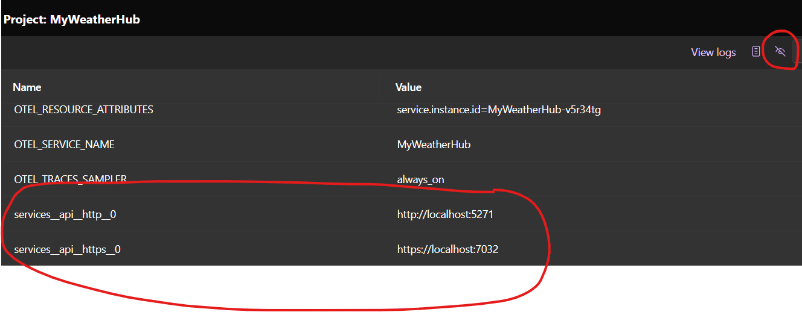

# Descubrimiento de servicios

.NET Aspire incluye funcionalidad para configurar el descubrimiento de servicios durante el desarrollo y las pruebas. La funcionalidad de descubrimiento de servicios funciona proporcionando configuración en el formato esperado para resolver puntos finales basado en configuración del proyecto .NET Aspire AppHost a los proyectos de servicios individuales agregados al modelo de aplicación.

## Configuración de descubrimiento de servicios

Actualmente, `MyWeatherHub` utiliza una configuración estática para conectarse a `Api`. Esto no es ideal por varias razones, incluyendo:

- El número de puerto del servicio `Api` puede cambiar.
- La dirección IP del servicio `Api` puede cambiar.
- Se necesitarían definir múltiples configuraciones para los ajustes de http y https.
- A medida que agregamos más servicios, la configuración se volvería más compleja.

Para abordar estos problemas, utilizaremos la funcionalidad de descubrimiento de servicios proporcionada por el proyecto .NET Aspire AppHost. Esto permitirá que el servicio `MyWeatherHub` descubra el servicio `Api` en tiempo de ejecución.

1. Abre el archivo `Program.cs` en el proyecto `AppHost`.
2. Anteriormente agregamos orquestación para incluir varios proyectos usando el método `builder.AddProject`. Esto devolvió un `IResourceBuild` que se puede usar para hacer referencia a los proyectos. Vamos a hacer referencia al proyecto `Api` en el proyecto `MyWeatherHub` actualizando el código:

	```csharp
	var api = builder.AddProject<Projects.Api>("api");

	var web = builder.AddProject<Projects.MyWeatherHub>("myweatherhub")
		 .WithReference(api)
		 .WithExternalHttpEndpoints();
	```

3. El método `WithReference` se utiliza para hacer referencia al proyecto `Api`. Esto permitirá que el proyecto `MyWeatherHub` descubra el proyecto `Api` en tiempo de ejecución.
4. Si más adelante decides desplegar esta aplicación, necesitarías la llamada a `WithExternalHttpEndpoints` para asegurarte de que sea público para el mundo exterior.

## Habilitar el descubrimiento de servicios en MyWeatherHub

Cuando agregamos ServiceDefaults a los proyectos, automáticamente los inscribimos en el sistema de descubrimiento de servicios. Esto significa que el proyecto `MyWeatherHub` ya está configurado para usar el descubrimiento de servicios.

Algunos servicios exponen múltiples puntos finales con nombres. Los puntos finales con nombres se pueden resolver especificando el nombre del punto final en la parte del host de la URI de la solicitud HTTP, siguiendo el formato `scheme://_nombrePuntoFinal.nombreServicio`. Por ejemplo, si un servicio llamado "basket" expone un punto final llamado "dashboard", entonces la URI `scheme+http://_dashboard.basket` se puede utilizar para especificar este punto final, por ejemplo:

```csharp
builder.Services.AddHttpClient<BasketServiceClient>(
	 static client => client.BaseAddress = new("https+http://basket"));

builder.Services.AddHttpClient<BasketServiceDashboardClient>(
	 static client => client.BaseAddress = new("https+http://_dashboard.basket"));
```

En el ejemplo anterior, `BasketServiceClient` utilizará el punto final predeterminado del servicio `basket`, mientras que `BasketServiceDashboardClient` utilizará el punto final `dashboard` del servicio `basket`. Ahora, actualicemos el proyecto `MyWeatherHub` para que use el descubrimiento de servicios para conectarse al servicio `Api`.

Esto se puede lograr actualizando la configuración existente de `WeatherEndpoint` en el archivo `appsettings.json`. Esto es conveniente cuando se habilita .NET Aspire en una aplicación implementada existente, ya que puedes seguir utilizando la configuración existente.

1. Abre el archivo `appsettings.json` en el proyecto `MyWeatherHub`.
2. Actualiza la configuración de `WeatherEndpoint` para usar el descubrimiento de servicios:

	```json
	"WeatherEndpoint": "https+http://api"
	```

3. Ahora, la configuración de `WeatherEndpoint` utiliza el descubrimiento de servicios para conectarse al servicio `Api`.

Opcionalmente, podemos actualizar la URL para no utilizar la configuración de `WeatherEndpoint`.

1. Abre el archivo `Program.cs` en el proyecto `MyWeatherHub`.
2. Actualiza la configuración de `WeatherEndpoint` para usar el descubrimiento de servicios:

	```csharp
	builder.Services.AddHttpClient<NwsManager>(
		 static client => client.BaseAddress = new("https+http://api"));
	```

## Ejecutar la aplicación

1. Ejecuta la aplicación presionando `F5` o seleccionando la opción `Iniciar depuración`.
2. Abre la aplicación `MyWeatheApp` seleccionando el punto final en el panel de control.
3. Observa que la aplicación `MyWeatherHub` sigue funcionando y ahora utiliza el descubrimiento de servicios para conectarse al servicio `Api`.
4. En el panel de control, haz clic en `Detalles` para el proyecto `MyWeatherHub`. Esto mostrará todas las configuraciones que .NET Aspire configuró al ejecutar la aplicación desde App Host.
5. Haz clic en el icono del ojo para revelar los valores y desplázate hasta la parte inferior donde verás `services__api_http_0` y `services__api_https_0` configurados con los valores correctos del servicio `Api`.

	

## Conclusión

Esto es solo el comienzo de lo que podemos hacer con el descubrimiento de servicios y .NET Aspire. A medida que nuestra aplicación crece y agregamos más servicios, podemos seguir utilizando el descubrimiento de servicios para conectar servicios en tiempo de ejecución. Esto nos permitirá escalar fácilmente nuestra aplicación y hacerla más resistente a los cambios en el entorno.

## Obtén más información

Puedes obtener más información sobre el uso y la configuración avanzada del descubrimiento de servicios en la documentación de [.NET Aspire Service Discovery](https://learn.microsoft.com/dotnet/aspire/service-discovery/overview).
