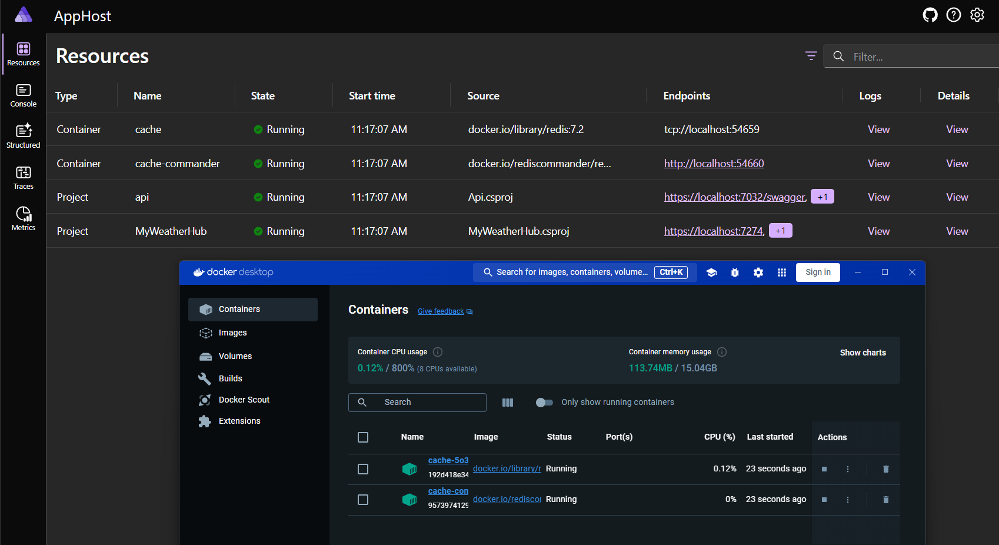
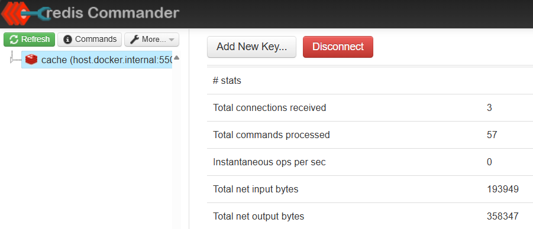
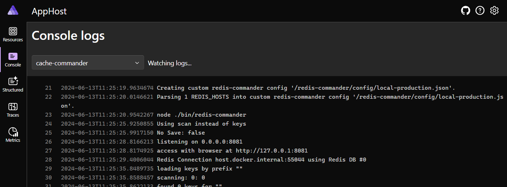
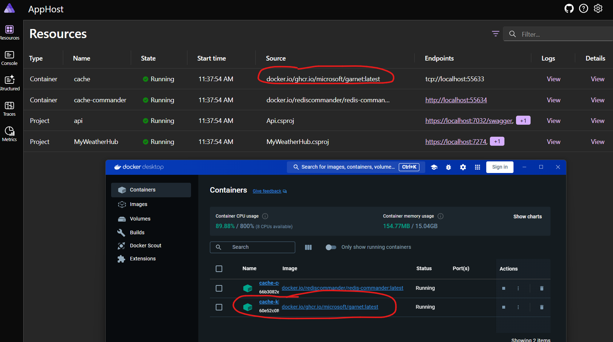
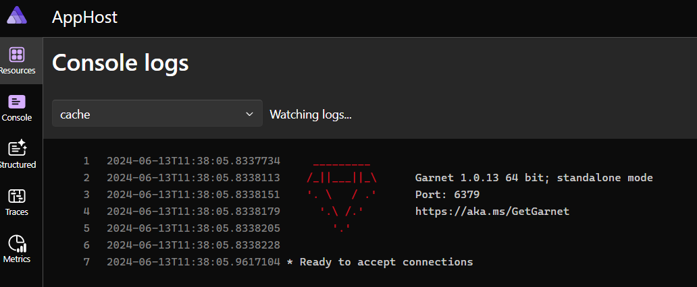

# Componentes .NET Aspire

Los componentes .NET Aspire son un conjunto curado de paquetes NuGet seleccionados específicamente para facilitar la integración de aplicaciones nativas de la nube con servicios y plataformas destacados, incluidos, entre otros, Redis y PostgreSQL. Cada componente proporciona funcionalidades esenciales para aplicaciones nativas de la nube a través de la provisión automática o patrones de configuración estandarizados. Los componentes .NET Aspire se pueden usar sin un proyecto de host de aplicación (orquestador), pero están diseñados para funcionar mejor con el host de aplicaciones .NET Aspire.

Los componentes .NET Aspire no deben confundirse con los paquetes de alojamiento .NET Aspire, ya que sirven para propósitos diferentes. Los paquetes de alojamiento se utilizan para modelar y configurar varios recursos en una aplicación .NET Aspire, mientras que los componentes se utilizan para mapear la configuración a varias bibliotecas de clientes.

Existe una lista en constante crecimiento de [Componentes .NET Aspire](https://learn.microsoft.com/dotnet/aspire/fundamentals/components-overview?tabs=dotnet-cli#available-components) creados y distribuidos por Microsoft y la comunidad. .NET Aspire es flexible y cualquiera puede crear su propio componente para integrarse con sus propios servicios.


Mejoremos nuestra aplicación añadiendo un componente. Vamos a añadir un componente que nos ayudará a conectarnos a una caché de Redis para mejorar el rendimiento de nuestra API.

## Añadir el Componente Redis al Host de la Aplicación

Existen dos tipos de caché que podríamos integrar en nuestra aplicación, incluyendo:

- **Caché de salida**: Un método de caché configurable y extensible para almacenar respuestas HTTP completas para futuras solicitudes.
- **Caché distribuido**: Una caché compartida por varios servidores de aplicaciones que permite cachear piezas específicas de datos. Una caché distribuida se mantiene típicamente como un servicio externo a los servidores de aplicaciones que acceden a ella y puede mejorar el rendimiento y la escalabilidad de una aplicación ASP.NET Core.

Integraremos el componente de _Caché de salida_ en nuestro host de la aplicación. Este componente nos ayudará a cachear la respuesta de nuestra API en la caché de Redis.

Para añadir el componente Redis a nuestro host de la aplicación, necesitamos instalar el paquete NuGet `Aspire.Hosting.Redis`. Este paquete proporciona los componentes necesarios para configurar el servicio en el Host de la Aplicación. Redis se proporciona a través de una imagen de contenedor en este taller, y cuando iniciamos el Host de la Aplicación .NET Aspire, automáticamente descargará la imagen del contenedor de Redis y empezará el servidor de Redis.

Con el NuGet instalado, podemos configurarlo.

1. Abre el archivo `Program.cs` en el proyecto `AppHost`.
1. Añade el siguiente código debajo de `var builder = DistributedApplication.CreateBuilder(args);`

	```csharp
	var cache = builder.AddRedis("cache")
	```
	Aquí, hemos configurado la caché de Redis con el nombre `cache`. Este nombre se utiliza para identificar la caché en `Api` o `MyWeatherHub`.
1. Actualiza el `api` en el Host de la Aplicación con una referencia a la caché.

	```csharp
	var api = builder.AddProject<Projects.Api>("api")
			.WithReference(cache);
	```

1. Adicionalmente, podríamos configurar [Redis Commander](https://joeferner.github.io/redis-commander/), una herramienta de gestión para Redis. Como parte del paquete `Aspire.Hosting.Redis`, Redis Commander está disponible en el mismo componente. Para añadir Redis Commander, agrega el siguiente código debajo de la nueva configuración de Redis añadida.

	```csharp
	var cache = builder.AddRedis("cache")
			.WithRedisCommander();
	```

## Ejecutar la aplicación

No hemos realizado cambios en los proyectos `Api` o `MyWeatherHub`, pero podemos ver el inicio de la caché de Redis cuando iniciamos el Host de la Aplicación.

> [!IMPORTANTE]
> Dado que Redis se ejecuta en un contenedor, necesitarás asegurarte de que Docker esté funcionando en tu máquina.

1. Inicia Docker Desktop o Podman.
1. Inicia el proyecto del Host de la Aplicación.
1. Verás tanto el contenedor de Redis como el contenedor de Redis Commander descargarse e iniciar tanto en el dashboard como en Docker Desktop.

	

## Integrar Caché de Salida en la API

1. Instala el paquete NuGet `Aspire.StackExchange.Redis.OutputCaching` en el proyecto `Api` para obtener acceso a las APIs de Redis.
1. Abre el archivo `Program.cs` en el proyecto `Api`.
1. Añade el siguiente código debajo de `var builder = WebApplication.CreateBuilder(args);` en la parte superior del archivo:

	```csharp
	builder.AddRedisOutputCache("cache");
	```

	> Ten en cuenta que estamos usando el nombre "cache" para referenciar la caché de Redis que configuramos en el Host de la Aplicación.
1. El `NwsManager` ya ha sido configurado para usar caché de salida, pero con una caché en memoria. Lo actualizaremos para usar la caché de Redis. Abre el archivo `NwsManager.cs` en la carpeta `Data`.
1. En la clase `NwsManagerExtensions` encontrarás un método `AddNwsManager`.
1. **ELIMINA** el siguiente código:

	```csharp
	// Añadir caché de salida predeterminada
	services.AddOutputCache(options =>
	{
		options.AddBasePolicy(builder => builder.Cache());
	});
	```

	Debido a que configuramos la aplicación para usar la caché de Redis en el archivo `Program.cs`, ya no necesitamos añadir la política de caché de salida predeterminada.

## Ejecutar la aplicación
1. Inicia el proyecto Host de la Aplicación y abre el proyecto `MyWeatherHub` desde el dashboard.
1. Haz clic en una ciudad y luego haz clic de nuevo. Verás que la respuesta está cacheada y la segunda solicitud es mucho más rápida que la primera bajo la pestaña `Traces`.

	

1. También puedes ver la respuesta cacheada en el Redis Commander. Abre el Redis Commander haciendo clic en el endpoint `Redis Commander` en el dashboard. Bajo estadísticas verás conexiones y comandos procesados.

	
1. Además, puedes ver los registros de la caché de Redis y del Redis Commander en la pestaña `Console`.

	

## Contenedores Redis Personalizados

Los componentes de .NET Aspire son flexibles y personalizables. Por defecto, el componente Redis utiliza una imagen de contenedor de Redis de Docker Hub. Sin embargo, puedes usar tu propia imagen de contenedor de Redis proporcionando el nombre de la imagen y la etiqueta después del método `AddRedis`. Por ejemplo, si tienes una imagen de contenedor de Redis personalizada como [Garnet](https://github.com/microsoft/garnet), puedes proporcionar el nombre de la imagen y la etiqueta en el Host de la Aplicación de la siguiente manera:

```csharp
var cache = builder.AddRedis("cache")
	.WithImage("ghcr.io/microsoft/garnet")
	.WithImageTag("latest")
	.WithRedisCommander();
```

1. Ejecuta la aplicación y ahora verás Garnet ejecutándose en el dashboard y en Docker Desktop.

	
1. También puedes ver los registros de Garnet en la pestaña `Consola`.

	


## Resumen
En esta sección, añadimos un componente Redis al Host de la Aplicación e integramos la caché de salida en la API. Vimos cómo la respuesta fue cacheada en la caché de Redis y cómo la segunda solicitud fue mucho más rápida que la primera. También vimos cómo usar Redis Commander para gestionar la caché de Redis.

Hay muchos más componentes disponibles que puedes usar para integrar con tus servicios. Puedes encontrar la lista de componentes disponibles [en la documentación de .NET Aspire](https://learn.microsoft.com/dotnet/aspire/fundamentals/components-overview?tabs=dotnet-cli#available-components).

Un siguiente paso natural sería integrar una base de datos o aprovechar Azure Redis Cache como una solución alojada. Componentes para estos y más están disponibles en NuGet.