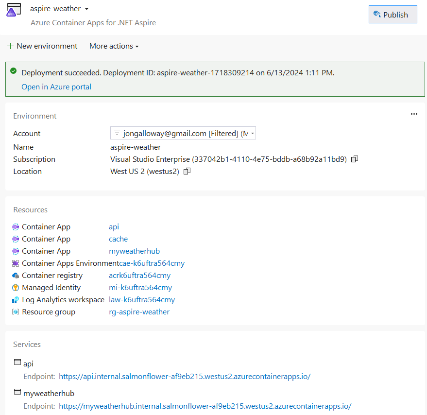

> 이 문서는 [Azure OpenAI](https://learn.microsoft.com/azure/ai-services/openai/overview)를 이용해 초벌 번역 후 검수를 진행했습니다. 따라서 번역 품질이 기대와 다를 수 있습니다. 문서 번역에 대해 제안할 내용이 있을 경우, [이슈](../../../issue)에 남겨주시면 확인후 반영하겠습니다.

# .NET Aspire 앱을 Azure Container Apps에 배포하기

.NET Aspire 앱은 컨테이너 환경에서 사용할 수 있도록 만들어졌습니다. Azure Container Apps는 서버리스 플랫폼에서 마이크로서비스와 컨테이너화된 애플리케이션을 실행할 수 있는 완전 관리형 환경입니다. 이 문서에서는 Visual Studio와 Azure Developer CLI(`azd`)를 사용하여 새로운 .NET Aspire 솔루션을 생성하고 Microsoft Azure Container Apps에 배포하는 과정을 안내합니다.

이 예제에서는 이전 섹션의 MyWeatherHub 앱을 배포한다고 가정합니다. 구축한 코드를 사용할 수 있으며, **complete** 디렉토리의 코드를 사용할 수도 있습니다. 그러나 모든 .NET Aspire 앱에 대한 단계는 동일합니다.

## Visual Studio로 앱 배포

1. 솔루션 탐색기에서 **AppHost** 프로젝트를 마우스 오른쪽 버튼으로 클릭하고 **Publish**를 선택하여 **Publish** 대화 상자를 엽니다.

  > [!TIP]
  > .NET Aspire를 게시하려면 최신 버전의 `azd` CLI가 필요합니다. 이는 .NET Aspire 워크로드와 함께 설치되어야 하지만, CLI가 설치되지 않았거나 최신 버전이 아니라는 알림이 표시되면 이 튜토리얼의 다음 부분에 따라 설치할 수 있습니다.

1. 게시 대상에서 **Azure Container Apps for .NET Aspire**를 선택합니다.

    

1. **AzDev Environment** 단계에서 원하는 **Subscription** 및 **Location** 값을 선택한 다음 **Environment Name**을 입력합니다(예: _aspire-weather_). 환경 이름은 Azure Container Apps 환경 리소스의 이름을 결정합니다.
1. **Finish**을 선택하여 환경을 생성한 다음 **Close**를 선택하여 대화 상자를 종료하고 배포 환경 요약을 확인합니다.
1. **Publish**를 선택하여 Azure에서 리소스를 프로비저닝하고 배포합니다.

    > [!TIP]
    > 이 프로세스는 완료하는 데 몇 분이 걸릴 수 있습니다. Visual Studio는 출력 로그에서 배포 진행 상태에 대한 상태 업데이트를 제공하며, 이 업데이트를 통해 게시 작업이 어떻게 진행되는지 많은 것을 배울 수 있습니다! 이 과정에서는 Resource Group, Azure Container Registry, Log Analytics Workspace 및 Azure Container Apps 환경을 생성하는 단계를 포함합니다. 그런 다음 앱을 Azure Container Apps 환경에 배포합니다.

1. 게시가 끝나면 Visual Studio는 환경 화면 하단에 리소스 URL을 표시합니다. 이러한 링크를 사용하여 배포를 끝낸 다양한 리소스를 볼 수 있습니다. **webfrontend** URL을 선택하여 배포된 앱을 브라우저에서 엽니다.

    

## Azure Developer CLI 설치

`azd`를 설치하는 과정은 운영 체제에 따라 다르지만, `winget`, `brew`, `apt` 또는 직접 `curl`을 통해 널리 제공됩니다. `azd`를 설치하려면 [Azure Developer CLI 설치](https://learn.microsoft.com/azure/developer/azure-developer-cli/install-azd)를 참조하세요.

### 템플릿 초기화

1. 새 터미널 창을 열고 .NET Aspire 프로젝트의 루트로 이동합니다.
1. `azd init` 명령을 실행하여 `azd`로 프로젝트를 초기화합니다. 이는 로컬 디렉토리 구조를 검사하고 앱 유형을 결정합니다.

    ```console
    azd init
    ```

    `azd init` 명령에 대한 자세한 내용은 [azd init](https://learn.microsoft.com/azure/developer/azure-developer-cli/reference#azd-init)을 참조하세요.

1. 앱을 처음 초기화하는 경우, `azd`는 환경 이름을 입력하라고 요청합니다:

    ```console
    Initializing an app to run on Azure (azd init)
    
    ? Enter a new environment name: [? for help]
    ```

    원하는 환경 이름을 입력하여 계속합니다. `azd`를 사용한 환경 관리에 대한 자세한 내용은 [azd env](https://learn.microsoft.com/azure/developer/azure-developer-cli/reference#azd-env)를 참조하세요.

1. `azd`가 앱 초기화 옵션을 두 가지로 묻는 경우 **Use code in the current directory**을 선택합니다.

    ```console
    ? How do you want to initialize your app?  [Use arrows to move, type to filter]
    > Use code in the current directory
      Select a template
    ```

1. 디렉토리를 스캔한 후, `azd`는 올바른 .NET Aspire _AppHost_ 프로젝트를 찾았는지 확인하라고 묻습니다. **Confirm and continue initializing my app** 옵션을 선택합니다.

    ```console
    Detected services:
    
      .NET (Aspire)
      Detected in: D:\source\repos\letslearn-dotnet-aspire\complete\AppHost\AppHost.csproj
    
    azd will generate the files necessary to host your app on Azure using Azure Container Apps.
    
    ? Select an option  [Use arrows to move, type to filter]
    > Confirm and continue initializing my app
      Cancel and exit
    ```

1. `azd`는 .NET Aspire 솔루션의 각 프로젝트를 표시하고 HTTP 인그레스를 공개적으로 열어 배포할 프로젝트를 식별하라고 묻습니다. `myweatherhub`만 선택합니다(↓ 및 Space 키를 사용). API는 Azure Container Apps 환경에 비공개로 설정되어 있으며 공개적으로 사용할 수 없습니다.

    ```console
    ? Select an option Confirm and continue initializing my app
    By default, a service can only be reached from inside the Azure Container Apps environment it is running in. Selecting a service here will also allow it to be reached from the Internet.
    ? Select which services to expose to the Internet  [Use arrows to move, space to select, <right> to all, <left> to none, type to filter]
      [ ]  apiservice
    > [x]  myweatherhub
    ```

1. 마지막으로, 프로비저닝된 리소스의 이름을 지정하고 `dev` 및 `prod`와 같은 다양한 환경을 관리하는 데 사용되는 환경 이름을 지정합니다.

    ```console
    Generating files to run your app on Azure:
    
      (✓) Done: Generating ./azure.yaml
      (✓) Done: Generating ./next-steps.md
    
    SUCCESS: Your app is ready for the cloud!
    You can provision and deploy your app to Azure by running the azd up command in this directory. For more information on configuring your app, see ./next-steps.md
    ```

`azd`는 여러 파일을 생성하고 작업 디렉토리에 배치합니다. 이러한 파일은 다음과 같습니다:

- _azure.yaml_: .NET Aspire AppHost 프로젝트와 같은 앱의 서비스를 설명하고 이를 Azure 리소스에 매핑합니다.
- _.azure/config.json_: `azd`가 현재 활성 환경이 무엇인지 알려주는 구성 파일.
- _.azure/aspireazddev/.env_: 환경별 재정의를 포함합니다.
- _.azure/aspireazddev/config.json_: 이 환경에서 어떤 서비스가 공개 엔드포인트를 가져야 하는지 `azd`에 알려주는 구성 파일.

좀 더 자세한 내용은 [.NET Aspire 프로젝트를 Azure Container Apps로 배포하기](https://learn.microsoft.com/dotnet/aspire/deployment/azure/aca-deployment?tabs=visual-studio%2Cinstall-az-windows%2Cpowershell&pivots=azure-azd#deploy-the-app) 페이지를 참조하세요.

### 앱 배포

`azd`가 초기화되면, 프로비저닝 및 배포 프로세스는 명령어 [azd up](https://learn.microsoft.com/azure/developer/azure-developer-cli/reference#azd-up) 한 줄만으로 실행할 수 있습니다.

```console
By default, a service can only be reached from inside the Azure Container Apps environment it is running in. Selecting a service here will also allow it to be reached from the Internet.
? Select which services to expose to the Internet webfrontend
? Select an Azure Subscription to use:  1. <YOUR SUBSCRIPTION>
? Select an Azure location to use: 1. <YOUR LOCATION>

Packaging services (azd package)


SUCCESS: Your application was packaged for Azure in less than a second.

Provisioning Azure resources (azd provision)
Provisioning Azure resources can take some time.

Subscription: <YOUR SUBSCRIPTION>
Location: <YOUR LOCATION>

  You can view detailed progress in the Azure Portal:
<LINK TO DEPLOYMENT>

  (✓) Done: Resource group: <YOUR RESOURCE GROUP>
  (✓) Done: Container Registry: <ID>
  (✓) Done: Log Analytics workspace: <ID>
  (✓) Done: Container Apps Environment: <ID>
  (✓) Done: Container App: <ID>

SUCCESS: Your application was provisioned in Azure in 1 minute 13 seconds.
You can view the resources created under the resource group <YOUR RESOURCE GROUP> in Azure Portal:
<LINK TO RESOURCE GROUP OVERVIEW>

Deploying services (azd deploy)

  (✓) Done: Deploying service apiservice
  - Endpoint: <YOUR UNIQUE apiservice APP>.azurecontainerapps.io/

  (✓) Done: Deploying service webfrontend
  - Endpoint: <YOUR UNIQUE webfrontend APP>.azurecontainerapps.io/


SUCCESS: Your application was deployed to Azure in 1 minute 39 seconds.
You can view the resources created under the resource group <YOUR RESOURCE GROUP> in Azure Portal:
<LINK TO RESOURCE GROUP OVERVIEW>

SUCCESS: Your up workflow to provision and deploy to Azure completed in 3 minutes 50 seconds.
```

먼저 `azd package` 단계에서 프로젝트가 컨테이너로 패키징된 후, `azd provision` 단계에서 애플리케이션이 필요로 하는 모든 Azure 리소스가 프로비저닝됩니다.

`provision`이 완료되면 `azd deploy`가 실행됩니다. 이 단계에서는 프로젝트가 Azure Container Registry 인스턴스로 컨테이너로 푸시된 다음, 코드를 호스팅할 Azure Container Apps의 새 리비전을 생성하는 데 사용됩니다.

이 시점에서 앱이 배포 및 구성되었으며, Azure 포털을 열어 리소스를 탐색할 수 있습니다.

## 리소스 정리

Azure 리소스가 더 이상 필요하지 않을 때 리소스 그룹을 삭제하려면 다음 Azure CLI 명령을 실행합니다. 리소스 그룹을 삭제하면 해당 그룹 내에 포함된 리소스도 삭제됩니다.

```console
az group delete --name <your-resource-group-name>
```
