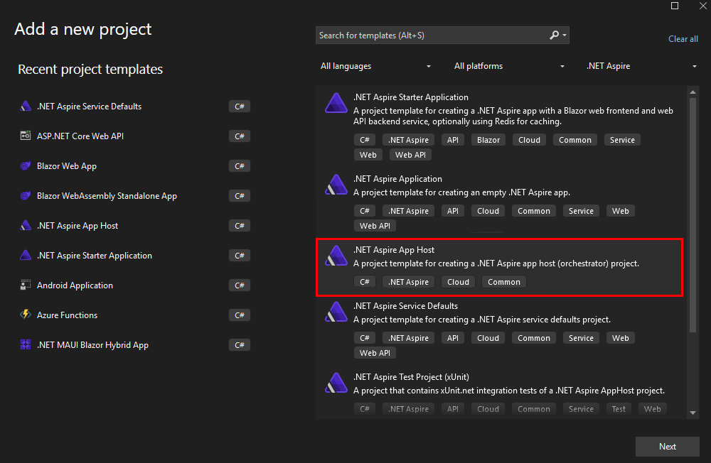

> 이 문서는 [Azure OpenAI](https://learn.microsoft.com/azure/ai-services/openai/overview)를 이용해 초벌 번역 후 검수를 진행했습니다. 따라서 번역 품질이 기대와 다를 수 있습니다. 문서 번역에 대해 제안할 내용이 있을 경우, [이슈](../../../issue)에 남겨주시면 확인후 반영하겠습니다.

# 대시보드 및 .NET Aspire App Host 프로젝트를 이용한 오케스트레이션

.NET Aspire는 분산 애플리케이션 내의 리소스와 종속성을 표현하기 위한 API를 제공합니다. 이러한 API 외에도 몇 가지 흥미로운 시나리오를 가능하게 하는 도구를 제공합니다. 오케스트레이터는 로컬 개발 목적으로 사용합니다.

계속하기 전에 .NET Aspire에서 사용하는 일반적인 용어를 확인해보세요:

- *앱 모델*: 분산 애플리케이션을 구성하는 리소스의 모음 (DistributedApplication). 공식적인 정의는 앱 모델 정의를 참조하세요.
- *앱 호스트/오케스트레이터 프로젝트*: 앱 모델을 오케스트레이션하는 .NET 프로젝트로, 관례적으로 *.AppHost 접미사로 이름을 지정합니다.
- *리소스*: 리소스는 .NET 프로젝트, 컨테이너, 실행 파일 또는 데이터베이스, 캐시, 클라우드 서비스(예: 스토리지 서비스)와 같은 애플리케이션의 한 부분을 나타냅니다.
- *참조*: 참조는 WithReference API를 사용하여 종속성으로 표현하는 리소스 간의 연결을 가리킵니다. 자세한 내용은 리소스 참조를 참조하세요.

## App Host 프로젝트 생성

### 비주얼 스튜디오 및 비주얼 스튜디오 코드

1. `AppHost`라는 새 프로젝트를 솔루션에 추가합니다:

    - 솔루션을 마우스 오른쪽 버튼으로 클릭하고 `Add` > `New Project`를 선택합니다.
    - `.NET Aspire App Host` 프로젝트 템플릿을 선택합니다.
    - 프로젝트 이름을 `AppHost`로 지정합니다.
    - `Next` > `Create`을 클릭합니다.

    *비주얼 스튜디오*
    

    *비주얼 스튜디오 코드*
    

### 명령줄(커맨드라인)

1. `dotnet new aspire-apphost` 명령을 사용하여 새 프로젝트를 생성합니다:

    ```bash
    dotnet new aspire-apphost -n AppHost
    ```

## 서비스 기본값 구성

1. 새로운 `AppHost` 프로젝트에서 `Api` 및 `MyWeatherHub` 프로젝트에 대한 참조를 추가합니다:

    - `AppHost` 프로젝트를 마우스 오른쪽 버튼으로 클릭하고 `Add` > `Reference`를 선택합니다.
        - `Api` 및 `MyWeatherHub` 프로젝트를 선택하고 `OK`를 클릭합니다.

    > Pro Tip: 비주얼 스튜디오 2022에서는 프로젝트를 다른 프로젝트로 끌어다 놓아 참조를 추가할 수 있습니다.

2. 이렇게 참조를 추가하면 소스 생성기가 자동으로 App Host에서 프로젝트를 참조하는 데 필요한 코드를 생성합니다.

## 애플리케이션 오케스트레이션

1. `AppHost` 프로젝트에서 `Program.cs` 파일을 업데이트하고 `var builder = DistributedApplication.CreateBuilder(args);` 줄 바로 다음에 다음 줄을 추가합니다:

    ```csharp
    var api = builder.AddProject<Projects.Api>("api");

    var web = builder.AddProject<Projects.MyWeatherHub>("myweatherhub");
    ```

## 애플리케이션 실행

1. 비주얼 스튜디오에서 `AppHost` 프로젝트를 시작 프로젝트로 설정하려면 `AppHost`를 마우스 오른쪽 버튼으로 클릭하고 `기본 프로젝트 설정`을 클릭합니다.
1. 비주얼 스튜디오 코드를 사용하는 경우 `launch.json`을 열고 모든 내용을 다음으로 교체합니다:

    ```json
    {
        "version": "0.2.0",
        "configurations": [
            {
                "name": "Run AppHost",
                "type": "dotnet",
                "request": "launch",
                "projectPath": "${workspaceFolder}/AppHost/AppHost.csproj"
            }
        ]
    }
    ```

1. 비주얼 스튜디오 코드 또는 비주얼 스튜디오의 `Run and Debug` 패널을 사용하여 App Host를 실행합니다.
1. .NET Aspire 대시보드가 기본 브라우저에서 열리고 애플리케이션의 리소스 및 종속성이 표시됩니다.

    

1. `MyWeatherHub`의 엔드포인트 [https://localhost:7274](https://localhost:7274)를 클릭하여 날씨 대시보드를 엽니다.
1. `Api` 및 `MyWeatherHub` 프로젝트가 동일한 프로세스에서 작동하고 있으며 구성 설정을 사용하여 이전과 동일하게 서로 통신할 수 있음을 확인합니다.
1. `View Logs` 버튼을 클릭하여 `Api` 및 `MyWeatherHub` 프로젝트의 로그를 확인합니다.
1. `Traces` 탭을 선택하고 API를 호출하는 트레이스에서 `View`를 선택합니다.

    ]

1. `Metrics` 탭을 탐색하여 `Api` 및 `MyWeatherHub` 프로젝트의 메트릭을 확인합니다.

    

## 오류 생성하기

1. 대시보드에서 `Structured` 탭을 엽니다.
1. `Level`을 `Error`로 설정하고 오류를 표시하지 않는 것을 확인합니다.
1. `MyWeatherApp` 웹사이트에서 여러 다른 도시를 클릭하여 오류를 생성합니다. 일반적으로 5개의 다른 도시를 클릭하면 오류가 발생합니다.
1. 오류를 생성한 후 대시보드의 `Structured` 탭이 자동으로 업데이트가 되며 오류를 표시합니다.

    
1. `Traces` 또는 `Details`를 클릭하여 오류 메시지와 스택 트레이스를 확인합니다.
