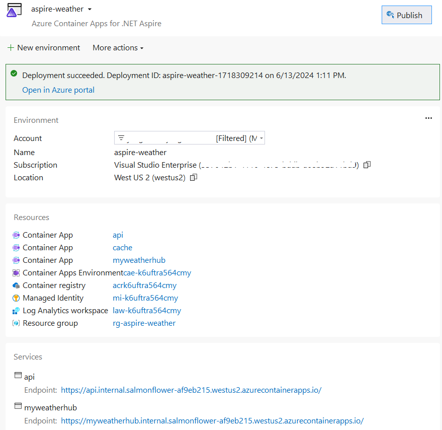

# Implante um aplicativo .NET Aspire no Azure Container Apps

Os aplicativos .NET Aspire são projetados para serem executados em ambientes conteinerizados. O Azure Container Apps é um ambiente totalmente gerenciado que permite executar microsserviços e aplicativos conteinerizados em uma plataforma sem servidor. Este artigo irá guiá-lo na criação de uma nova solução .NET Aspire e na implantação dela no Microsoft Azure Container Apps usando o Visual Studio e o Azure Developer CLI (`azd`).

Neste exemplo, assumiremos que você está implantando o aplicativo MyWeatherHub das seções anteriores. Você pode usar o código que construiu, ou pode usar o código no diretório **complete**. No entanto, os passos são os mesmos para qualquer aplicativo .NET Aspire.

## Implante o aplicativo com o Visual Studio

1. No solution explorer, clique com o botão direito do mouse no projeto **AppHost** e selecione **Publish** para abrir a caixa de diálogo **Publish**.

  > [!TIP]
  > Publicar o .NET Aspire requer a versão atual do CLI `azd`. Isso deve ser instalado com o .NET Aspire, mas se você receber uma notificação de que o CLI não está instalado ou atualizado, você pode seguir as instruções na próxima parte deste tutorial para instalá-lo.

1. Selecione **Azure Container Apps for .NET Aspire** como o destino de publicação.
    
1. Na etapa **AzDev Environment**, selecione os valores de **Subscription** e **Location** desejados e, em seguida, insira um **nome do Ambiente (environment)** como _aspire-weather_. O nome do ambiente determina a nomeação dos recursos do ambiente Azure Container Apps.
1. Selecione **Finish** para criar o ambiente, depois **Close** para sair da caixa de diálogo e visualizar o resumo do ambiente de implantação.
1. Selecione **Publish** para provisionar e implantar os recursos no Azure.
    > [!TIP]
    > Este processo pode levar vários minutos para ser concluído. O Visual Studio fornece atualizações de status sobre o progresso da implantação nos logs de saída e você pode aprender muito sobre como a publicação funciona observando essas atualizações! Você verá que o processo envolve a criação de um grupo de recursos, um Registro de Contêineres Azure, um espaço de trabalho do Log Analytics e um ambiente Azure Container Apps. O aplicativo é então implantado no ambiente Azure Container Apps.

1. Quando a publicação for concluída, o Visual Studio exibirá as URLs dos recursos na parte inferior da tela do ambiente. Use esses links para visualizar os vários recursos implantados. Selecione a URL **webfrontend** para abrir um navegador para o aplicativo implantado.
    

## Instale o Azure Developer CLI

O processo para instalar o `azd` varia com base no seu sistema operacional, mas está amplamente disponível via `winget`, `brew`, `apt`, ou diretamente via `curl`. Para instalar o `azd`, consulte [Instalar o Azure Developer CLI](https://learn.microsoft.com/azure/developer/azure-developer-cli/install-azd).

### Inicialize o modelo (template) do aplicativo

1. Abra uma nova janela do terminal e `cd` na raiz do seu projeto .NET Aspire.
1. Execute o comando `azd init` para inicializar seu projeto com `azd`, que irá inspecionar a estrutura de diretórios local e determinar o tipo de aplicativo.

    ```console
    azd init
    ```

    Para mais informações sobre o comando `azd init`, consulte [azd init](https://learn.microsoft.com/azure/developer/azure-developer-cli/reference#azd-init).
1. Se esta for a primeira vez que você inicializou o aplicativo, o `azd` solicitará o nome do ambiente:

    ```console
    Initializing an app to run on Azure (azd init)
    
    ? Enter a new environment name: [? for help]
    ```

    Insira o nome do ambiente desejado para continuar. Para mais informações sobre o gerenciamento de ambientes com `azd`, consulte [azd env](https://learn.microsoft.com/azure/developer/azure-developer-cli/reference#azd-env).
1. Selecione **Use code in the current directory** quando o `azd` solicitar com duas opções de inicialização do aplicativo.

    ```console
    ? How do you want to initialize your app?  [Use arrows to move, type to filter]
    > Use code in the current directory
      Select a template
    ```

1. Após escanear o diretório, o `azd` solicita que você confirme que encontrou o projeto _AppHost_ .NET Aspire correto. Selecione a opção **Confirmar e continuar inicializando meu aplicativo**.

    ```console
    Detected services:
    
      .NET (Aspire)
      Detected in: D:\source\repos\letslearn-dotnet-aspire\complete\AppHost\AppHost.csproj
    
    azd will generate the files necessary to host your app on Azure using Azure Container Apps.
    
    ? Select an option  [Use arrows to move, type to filter]
    > Confirm and continue initializing my app
      Cancel and exit
    ```

1. `azd` apresenta cada um dos projetos na solução .NET Aspire e solicita que você identifique qual deles implantar com ingresso HTTP aberto publicamente para todo o tráfego da internet. Selecione apenas o `myweatherhub` (usando as teclas ↓ e Espaço), já que você deseja que a API seja privada ao ambiente Azure Container Apps e _não_ disponível publicamente.

    ```console
    ? Select an option Confirm and continue initializing my app
    By default, a service can only be reached from inside the Azure Container Apps environment it is running in. Selecting a service here will also allow it to be reached from the Internet.
    ? Select which services to expose to the Internet  [Use arrows to move, space to select, <right> to all, <left> to none, type to filter]
      [ ]  apiservice
    > [x]  myweatherhub
    ```

1. Finalmente, especifique o nome do ambiente, que é usado para nomear os recursos provisionados no Azure e gerenciar diferentes ambientes, como `dev` e `prod`.

    ```console
    Generating files to run your app on Azure:
    
      (✓) Done: Generating ./azure.yaml
      (✓) Done: Generating ./next-steps.md
    
    SUCCESS: Your app is ready for the cloud!
    You can provision and deploy your app to Azure by running the azd up command in this directory. For more information on configuring your app, see ./next-steps.md
    ```

`azd` gera vários arquivos e os coloca no diretório de trabalho. Esses arquivos são:

- _azure.yaml_: Descreve os serviços do aplicativo, como o projeto .NET Aspire AppHost, e os mapeia para recursos do Azure.
- _.azure/config.json_: Arquivo de configuração que informa ao `azd` qual é o ambiente ativo atual.
- _.azure/aspireazddev/.env_: Contém substituições específicas do ambiente.
- _.azure/aspireazddev/config.json_: Arquivo de configuração que informa ao `azd` quais serviços devem ter um ponto de extremidade público neste ambiente.

[Deploy a .NET Aspire project to Azure Container Apps](https://learn.microsoft.com/dotnet/aspire/deployment/azure/aca-deployment)

### Implante o aplicativo

Uma vez que o `azd` é inicializado, o processo de provisionamento e implantação pode ser executado como um único comando, [azd up](https://learn.microsoft.com/azure/developer/azure-developer-cli/reference#azd-up).

```console

By default, a service can only be reached from inside the Azure Container Apps environment it is running in. Selecting a service here will also allow it to be reached from the Internet.
? Select which services to expose to the Internet webfrontend
? Select an Azure Subscription to use:  1. <YOUR SUBSCRIPTION>
? Select an Azure location to use: 1. <YOUR LOCATION>

Packaging services (azd package)


SUCCESS: Your application was packaged for Azure in less than a second.

Provisioning Azure resources (azd provision)
Provisioning Azure resources can take some time.

Subscription: <YOUR SUBSCRIPTION>
Location: <YOUR LOCATION>

  You can view detailed progress in the Azure Portal:
<LINK TO DEPLOYMENT>

  (✓) Done: Resource group: <YOUR RESOURCE GROUP>
  (✓) Done: Container Registry: <ID>
  (✓) Done: Log Analytics workspace: <ID>
  (✓) Done: Container Apps Environment: <ID>
  (✓) Done: Container App: <ID>

SUCCESS: Your application was provisioned in Azure in 1 minute 13 seconds.
You can view the resources created under the resource group <YOUR RESOURCE GROUP> in Azure Portal:
<LINK TO RESOURCE GROUP OVERVIEW>

Deploying services (azd deploy)

  (✓) Done: Deploying service apiservice
  - Endpoint: <YOUR UNIQUE apiservice APP>.azurecontainerapps.io/

  (✓) Done: Deploying service webfrontend
  - Endpoint: <YOUR UNIQUE webfrontend APP>.azurecontainerapps.io/


SUCCESS: Your application was deployed to Azure in 1 minute 39 seconds.
You can view the resources created under the resource group <YOUR RESOURCE GROUP> in Azure Portal:
<LINK TO RESOURCE GROUP OVERVIEW>

SUCCESS: Your up workflow to provision and deploy to Azure completed in 3 minutes 50 seconds.
```

Primeiro, os projetos serão empacotados em contêineres durante a fase `azd package`, seguida pela fase `azd provision` durante a qual todos os recursos do Azure necessários para o aplicativo serão provisionados.

Uma vez que o `provision` esteja completo, ocorrerá o `azd deploy`. Durante esta fase, os projetos são enviados como contêineres para uma instância do Azure Container Registry e, em seguida, usados para criar novas revisões de Azure Container Apps nos quais o código será hospedado.

Neste ponto, o aplicativo foi implantado e configurado, e você pode abrir o Portal Azure e explorar os recursos.

## Limpar recursos

Execute o seguinte comando do Azure CLI para deletar o grupo de recursos quando você não precisar mais dos recursos do Azure que criou. Deletar o grupo de recursos também deleta os recursos contidos dentro dele.

```console
az group delete --name <nome-do-seu-grupo-de-recursos>
```
